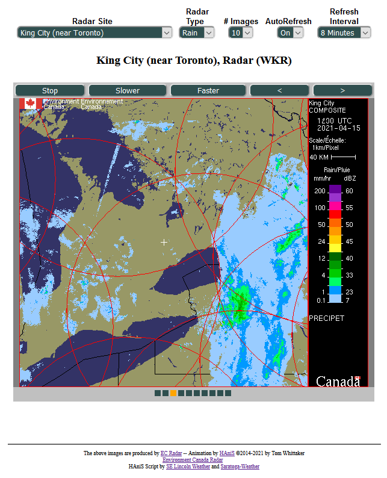
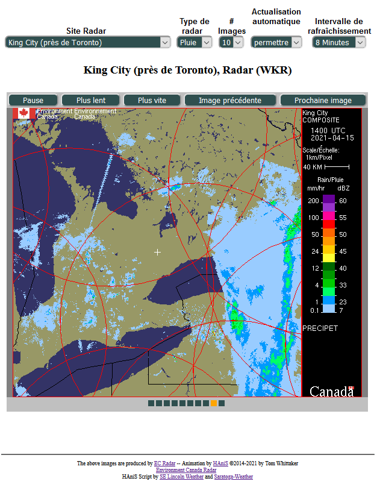
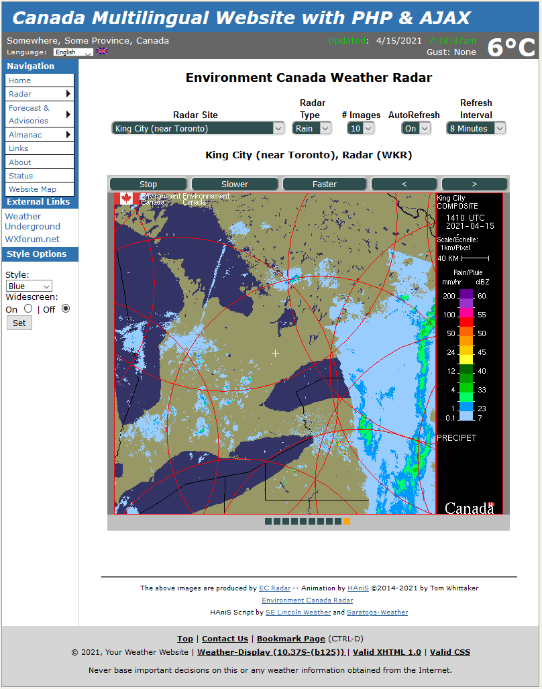
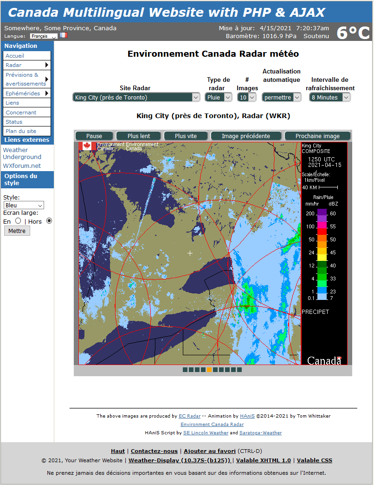

# wxecradar
Environment Canada radar animation using HAniS JavaScript

As of 30-Mar-2021, Environment Canada changed their Radar website to use a map to display radar information, and
stopped publishing radar images as .gif files on their main website.  This rendered the former display script
of [**_ec-radar.php_**](https://github.com/ktrue/ec-radar) obsolete and non-functional (since the images were no longer available).

Fortunately, the radar .gif images continue to be published on https://dd.weather.gc.ca/radar/PRECIPET/GIF/\{sitename\}/
**but** sadly, they no longer have the detail overlays of towns, highways, rivers on the new maps. So, the new .gif
radar images are a bit sparse but do otherwise display the 14-color versions of the original .gif images.  Also, no national composite image is available; the regional images are available.

## Contents:
* For standalone or [Saratoga template](https://saratoga-weather.org/wxtemplates/) use:
  *  **_wxecradar-SA.php_**     (the standalone version of the page to run the scripts)
  *  **_wxecradar-inc.php_**    (provides selection capability and \<iframe\> for HAniS display)
  *  **_wxecradar-iframe.php_** (provides contents to display in the \<iframe\>)
  *  **_wxecradar-list-inc.php_**  (list of current radar stations for display, will be updated periodically as sites change)
  *  **_hanis_min.js_**      (the HAniS script)

* For Saratoga Base-Canada template scripts \[see live [demo](https://saratoga-weather.org/wxtemplates/Canada/wxindex.php)\]
  *  **_wxindex.php_**       (updated to use _wxecradar-iframe.php_ to display a radar image set)
  *  **_wxradar.php_**       (updated to use the scripts in a Saratoga template page)

All the files should be in the same directory (normally, the document root of the website).

**Note:** the wxecradar scripts are included with the Saratoga template Base-Canada distribution and can be maintained by using the [template update tool](https://saratoga-weather.org/wxtemplates/updates.php).

## Installation (for standalone use)

* Copy the 5 files listed in the standalone section above to a directory on your website.
* customize the settings in **_wxecradar-SA.php_** to select your default radar site and default language.

## Sample images

### Standalone script English

### Standalone script French

### Template script English

### Template script French

